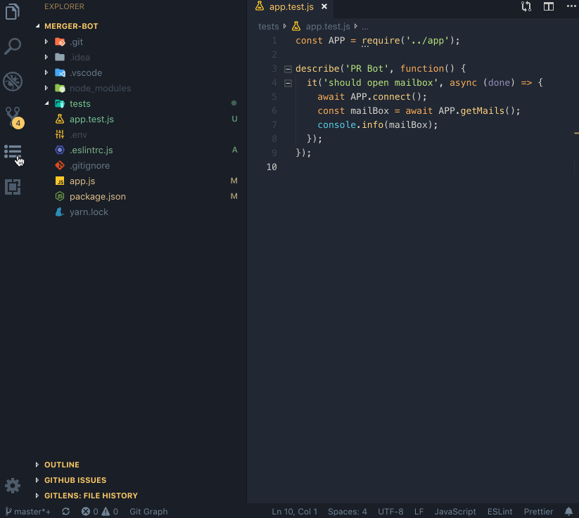

<h2 align="center">JirAux</h2>

<p align="center">
  <a href="https://travis-ci.com/Semyonic/JirAux"></a> <a href="https://marketplace.visualstudio.com/items?itemName=SemihOnay.JirAux"></a> <a href="https://marketplace.visualstudio.com/items?itemName=SemihOnay.JirAux"> </a> <a href="https://marketplace.visualstudio.com/items?itemName=SemihOnay.JirAux"></a>
</p>

Simple extension to create Git-flow like branches from selected issues and view their descriptions.

<p align="center">

</p>

# Features
- [x] Create branches with automatically prefixed from task/issue types
- [x] Customize task/issue types
- [x] Open issue in default browser
- [x] View descriptions in editor
- [x] Fetch new issues/tasks


# Upcoming Features
- Start/stop progress of current tasks/issues
- Close tasks/issues
- Upload time sheet logs


# Setup

Define the following settings in your **settings.json** :

## Never place this configuration in your projects **settings.json** !

- `jira.baseUrl`
- `jira.username`
- `jira.password`

**Example:**

```json
"jira.baseUrl": "https://jira.your-company.com",
"jira.username": "myMail@domain.com",
"jira.password": "secretPassword",
"jira.issueTypes": {
    "bugs": ["Bug","Sub-Bug","Defect", "Hata"],
    "issues": ["Task","Sub-Task","Sub-Gelistirme","Gelistirme"]
  },
```

## Polling
#
Issue checker interval can be configured with `poll` key in **settings.json**

Value must be in number as a **Milisecond**

**Example**

```json
"jira.poll": 450000
```

## Custom Issue Types
#

Bugs and task type definitions can be customized by adding configuration in **settings.json**

**Example**

```json
"jira.issueTypes": {
    "bugs": ["Bug","Sub-Bug","Defect", "Hata"],
    "issues": ["Task","Sub-Task","Sub-Gelistirme","Gelistirme"]
  }
```

# Contributing

File bugs and feature requests in [GitHub Issues](https://github.com/Semyonic/JirAux/issues).
Checkout the source code in the [GitHub Repository](https://github.com/Semyonic/JirAux).

# License

[MIT](./LICENSE)
